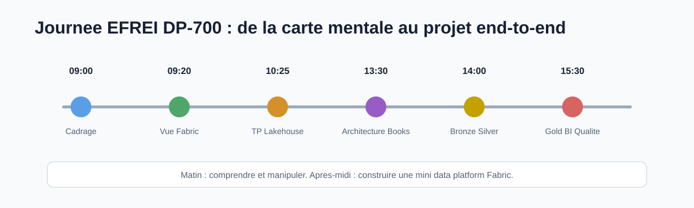
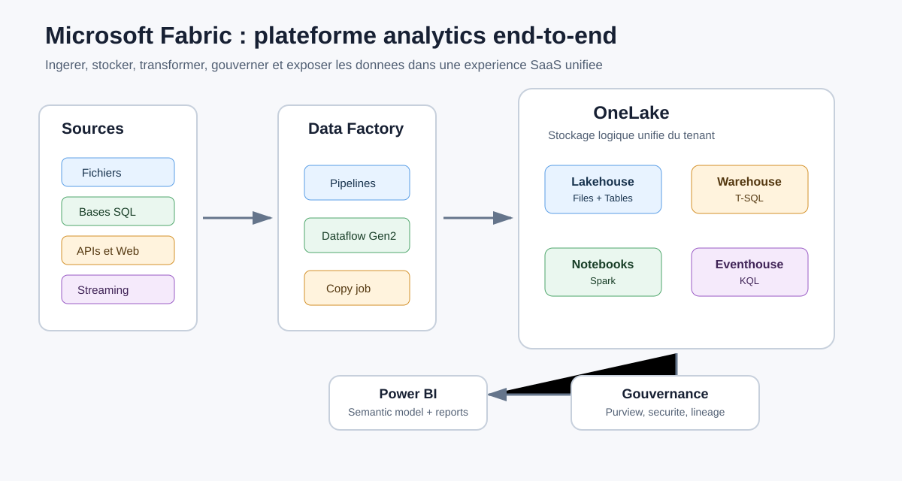
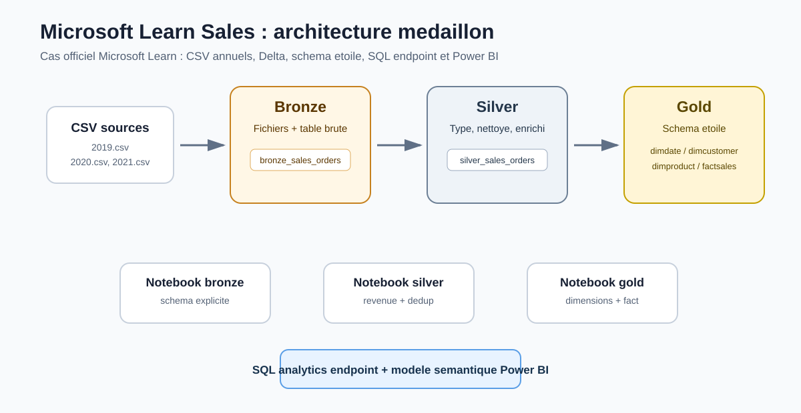

# Data Engineering on Cloud avec Microsoft Fabric

## Mot de l'intervenant

Cette journee est pensee comme une immersion pratique dans le metier de Data Engineer Cloud.

Nous utiliserons Microsoft Fabric comme terrain d'experimentation, mais les raisonnements vus ensemble s'appliquent aussi a d'autres plateformes modernes comme Azure, AWS, Databricks, Snowflake ou des stacks open source.

---

## Objectif de la journee

L'objectif de cette journee est de comprendre comment construire une chaine de donnees moderne dans le cloud avec **Microsoft Fabric**.

Nous n'allons pas seulement creer des objets dans Fabric. Nous allons surtout comprendre comment un **Data Engineer** reflechit lorsqu'il doit concevoir une solution analytique fiable, maintenable et exploitable par les metiers.

---

## Question a retenir

A la fin de la journee, vous devez etre capables de repondre a cette question :

> Comment construire une plateforme analytique simple, de bout en bout, depuis les donnees brutes jusqu'a leur exposition dans Power BI ?

---

## Intention pedagogique

La journee alternera trois formats :

- **Carte mentale** : comprendre les concepts et l'architecture.
- **Manipulation** : creer des objets Fabric et executer des traitements.
- **Prise de recul** : expliquer pourquoi on choisit tel ou tel composant.

---

## Idee principale

> Microsoft Fabric n'est pas seulement "Power BI avec des notebooks".
>
> C'est une plateforme SaaS unifiee pour ingerer, stocker, transformer, gouverner, monitorer et exposer des donnees.

---

## Fil rouge

Nous utiliserons le cas d'une **librairie en ligne**.

Question de depart :

> Vous devez construire rapidement une plateforme analytique pour une librairie en ligne.
>
> Qu'est-ce que vous creez dans Fabric, dans quel ordre, et pourquoi ?

---

## Questions qui guideront la journee

- Ou stocker les donnees brutes ?
- Quand nettoyer les donnees ?
- Quand modeliser les donnees ?
- Qui consomme les donnees ?
- Comment eviter les doublons ?
- Comment rejouer un traitement ?
- Comment prouver que les donnees sont fiables ?
- Comment exposer les donnees aux metiers ?
- Comment monitorer la solution ?
- Que faudrait-il ameliorer pour passer en production ?

---

## Competences visees

A la fin de la journee, vous devrez etre capables de :

- Expliquer le role de **Microsoft Fabric** dans une Modern Data Platform.
- Comprendre le role de **OneLake**.
- Differencier **Lakehouse**, **Warehouse**, **SQL Analytics Endpoint** et **Semantic Model**.
- Choisir entre **Pipeline**, **Dataflow Gen2** et **Notebook**.
- Construire une architecture simple en couches **Bronze / Silver / Gold**.
- Charger des donnees dans un **Lakehouse**.
- Transformer des donnees avec un **Notebook**.
- Orchestrer plusieurs etapes dans un **Pipeline**.
- Ajouter des controles qualite simples.
- Exposer des donnees Gold pour l'analyse.
- Identifier les elements necessaires pour industrialiser la solution.

---

# Deroule de la journee



---

## 1. Cadrage

**Comprendre le role du Data Engineer Cloud**

Durée indicative : **20 minutes**

### Objectifs

- Comprendre le role du Data Engineer dans une architecture cloud.
- Distinguer outil, service cloud et plateforme analytique.
- Positionner Microsoft Fabric dans l'ecosysteme data moderne.

---

## Questions de depart

- Qu'est-ce qu'un Data Engineer ?
- Quelle difference entre Data Engineer, Data Analyst et Data Scientist ?
- Pourquoi parle-t-on de plateforme data moderne ?
- Pourquoi le cloud a-t-il change la maniere de construire les plateformes data ?

---

## Message cle

> Le Data Engineer ne se contente pas de deplacer des donnees.
>
> Il construit des chaines fiables pour rendre la donnee exploitable, tracable, securisee et utile aux metiers.

---

## 2. Vue d'ensemble de Microsoft Fabric

Durée indicative : **45 a 60 minutes**

### Objectifs

Decouvrir les principaux composants Microsoft Fabric :

- Workspace
- OneLake
- Lakehouse
- Warehouse
- Pipeline
- Dataflow Gen2
- Notebook
- Semantic Model
- Power BI

---

## Microsoft Fabric en une image



---

## Concepts cles Fabric

| Composant | Role |
| --- | --- |
| Workspace | Espace de travail, securite et cycle de vie |
| OneLake | Stockage logique unifie du tenant Fabric |
| Lakehouse | Stockage fichiers + tables Delta |
| Warehouse | Entrepot SQL analytique |
| Pipeline | Orchestration des traitements |
| Dataflow Gen2 | Transformation low-code avec Power Query |
| Notebook | Transformation code-first avec Spark/Python |
| Semantic Model | Couche metier pour Power BI |

---

## Message cle

> Fabric assemble plusieurs experiences data autour de OneLake et d'un modele SaaS commun.

---

## 3. TP 1

**Lakehouse, OneLake et SQL Analytics Endpoint**

Durée indicative : **60 minutes**

### Objectif du TP

Creer une premiere base de travail dans Fabric :

1. Creer ou utiliser un workspace.
2. Creer un Lakehouse.
3. Charger un fichier CSV.
4. Creer une table Delta.
5. Interroger les donnees via le SQL Analytics Endpoint.

---

## TP 1 - Ce que vous devez comprendre

- La difference entre **Files** et **Tables** dans un Lakehouse.
- Pourquoi une table Lakehouse est visible cote SQL.
- Pourquoi le SQL Analytics Endpoint est principalement une couche de lecture.
- Comment OneLake sert de stockage commun.

---

## TP 1 - Questions de debrief

- Ou sont stockees physiquement les donnees ?
- Pourquoi la table apparait-elle cote SQL ?
- Quelle difference entre un fichier brut et une table Delta ?
- Quelles donnees faudrait-il conserver en Bronze ?

---

## 4. TP 2

**Pipeline, Dataflow Gen2 et Notebook**

Durée indicative : **60 minutes**

### Objectif du TP

Comparer trois manieres de traiter les donnees dans Fabric :

- Pipeline
- Dataflow Gen2
- Notebook

---

## TP 2 - Choisir le bon outil

| Besoin | Outil recommande |
| --- | --- |
| Copier ou orchestrer des donnees | Pipeline |
| Transformer visuellement des donnees | Dataflow Gen2 |
| Ecrire du code Python/Spark | Notebook |
| Planifier un enchainement d'etapes | Pipeline |
| Appliquer une logique complexe | Notebook |

---

## Message cle

> Un pipeline sert surtout a orchestrer.
>
> Un Dataflow Gen2 sert a transformer en low-code.
>
> Un Notebook sert a transformer avec du code et Spark.

---

## TP 2 - Questions de debrief

- Quand utiliser un Dataflow Gen2 ?
- Quand utiliser un Notebook ?
- Quand utiliser un Pipeline ?
- Pourquoi ne pas tout faire dans un seul outil ?

---

# Projet fil rouge

## Librairie en ligne


---

## 5. Cadrage metier

Durée indicative : **30 minutes**

### Objectif

Partir d'un besoin metier avant de creer les tables.

Chaque groupe doit proposer :

- 3 questions metier.
- Les tables Gold attendues.
- Les controles qualite minimaux.

---

## Exemples de questions metier

- Quels sont les livres les mieux notes ?
- Quelle est la repartition des prix par categorie ?
- Combien de livres sont disponibles par categorie ?
- Quel est le prix moyen des livres ?
- Quelles categories semblent les plus attractives ?

---

## Message cle

> Une bonne architecture data commence par les usages metier, pas par les outils.

---

## 6. Construire Bronze et Silver

Durée indicative : **1h15**

### Objectif

Construire les premieres couches de l'architecture medaillon.

```text
Sources
  ↓
Bronze
  ↓
Silver
```

---

## Couche Bronze

La couche Bronze contient les donnees brutes ou tres peu transformees.

### Objectifs

- Conserver la donnee source.
- Pouvoir rejouer les traitements.
- Garder une trace de l'ingestion.
- Faciliter le debugging.

### Exemples

- `books_html_raw`
- `books_json_raw`

---

## Couche Silver

La couche Silver contient les donnees nettoyees, typees et normalisees.

### Objectifs

- Corriger les types.
- Nettoyer les valeurs.
- Dedupliquer.
- Structurer les colonnes.
- Preparer la donnee pour l'analyse.

### Exemples

- `books_clean`
- `categories_clean`

---

## Message cle

> Garder les donnees brutes permet de rejouer un traitement sans dependre a nouveau de la source.

---

## 7. Construire Gold et la qualite

Durée indicative : **1h00**

### Objectif

Creer des donnees pretes pour l'analyse metier.

```text
Bronze
  ↓
Silver
  ↓
Gold
```

---

## Couche Gold

La couche Gold contient les donnees modelisees pour les usages metier.

### Exemples

- `gold_books`
- `gold_categories`
- `gold_price_analysis`
- `gold_availability_analysis`

---

## Controles qualite minimaux

Exemples de controles :

- Verifier que le prix n'est pas negatif.
- Verifier que le titre du livre n'est pas vide.
- Verifier que la categorie existe.
- Verifier qu'il n'y a pas de doublons sur l'identifiant du livre.
- Verifier le nombre de lignes attendues.
- Verifier les valeurs manquantes critiques.

---

## Message cle

> Une table Gold n'est pas seulement une table propre.
>
> C'est une table pensee pour repondre a des questions metier.

---

## 8. Orchestrer le traitement end-to-end

Durée indicative : **45 minutes**

### Objectif

Creer ou analyser un pipeline complet.

```text
Notebook Bronze
  ↓
Notebook Silver
  ↓
Notebook Gold
  ↓
Notebook Qualite
```

---

## Pipeline - Points a observer

- L'ordre des etapes.
- Les dependances entre traitements.
- Les parametres eventuels.
- Les erreurs possibles.
- Les logs d'execution.
- Les possibilites de relance.

---

## Message cle

> Une solution data professionnelle doit etre orchestree, monitoree et relancable.

---

## 9. Exposer les donnees

Durée indicative : **30 minutes**

### Objectif

Comprendre comment les donnees deviennent consommables.

### Possibilites d'exposition

- SQL Analytics Endpoint
- Warehouse
- Semantic Model
- Power BI
- Applications ou APIs

---

## Exposition - Questions a se poser

- Les utilisateurs doivent-ils acceder aux tables directement ?
- Faut-il une couche semantique ?
- Quelles mesures metier faut-il creer ?
- Quelles tables doivent etre visibles ?
- Comment securiser l'acces aux donnees ?

---

## Message cle

> Le travail du Data Engineer ne s'arrete pas au chargement des donnees.
>
> Il doit preparer une donnee fiable, comprehensible et consommable.

---

## 10. Restitution finale

Durée indicative : **25 minutes**

Chaque groupe presente en 2 minutes :

- L'architecture retenue.
- Les tables creees.
- Le controle qualite le plus important.
- Le choix d'outil le plus structurant.
- Une amelioration possible pour passer en production.

---

## Questions de restitution

- Pourquoi avez-vous separe Bronze, Silver et Gold ?
- Quel outil Fabric avez-vous utilise pour chaque etape ?
- Comment relanceriez-vous le pipeline en cas d'echec ?
- Quel controle qualite vous semble indispensable ?
- Que faudrait-il ajouter pour industrialiser la solution ?

---

## Variante de secours

Si le reseau, les acces ou le scraping ne fonctionnent pas correctement, nous utiliserons une version alternative basee sur :

- Des fichiers deja prepares.
- Des notebooks pre-ecrits.
- Des jeux de donnees Microsoft Learn.
- Une demonstration guidee etape par etape.

---

## Objectif de la variante

Ne pas dependre d'un site externe ou d'un acces reseau instable pour comprendre les concepts cles.

Use case de secours :

- `usecases/02-mslearn-sales-medallion/`



---

# Synthese de la journee

```text
Sources
  ↓
Ingestion
  ↓
OneLake
  ↓
Lakehouse Bronze
  ↓
Lakehouse Silver
  ↓
Gold / Warehouse
  ↓
Semantic Model
  ↓
Power BI / SQL / Applications
```

---

## Microsoft Fabric permet de construire une chaine complete

- Ingestion
- Stockage
- Transformation
- Orchestration
- Qualite
- Gouvernance
- Monitoring
- Exposition

---

## Phrase finale

> Le cloud fournit les briques.
>
> Le role du Data Engineer est de les assembler proprement pour produire une donnee fiable, gouvernee, performante et utile aux metiers.

