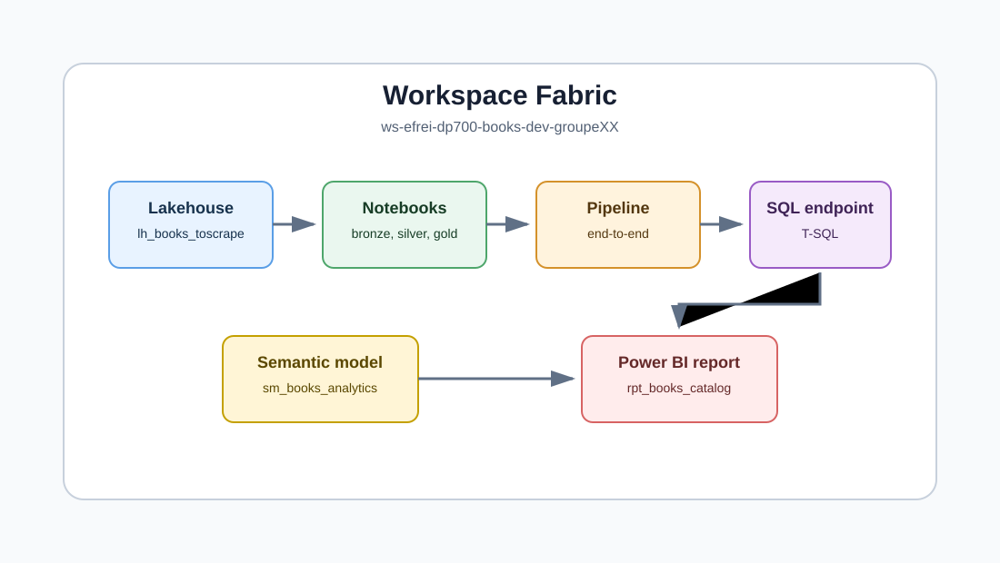
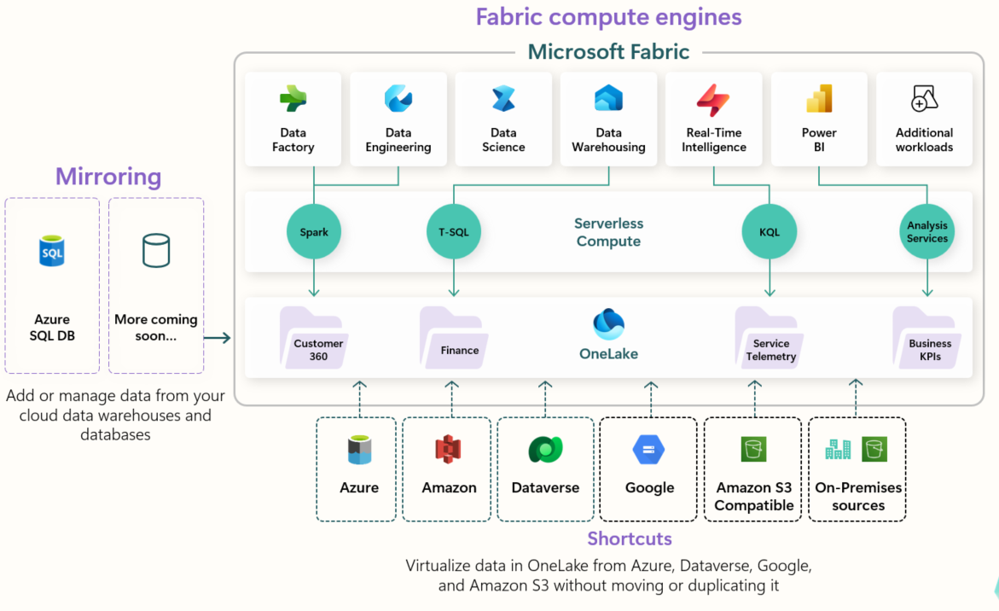
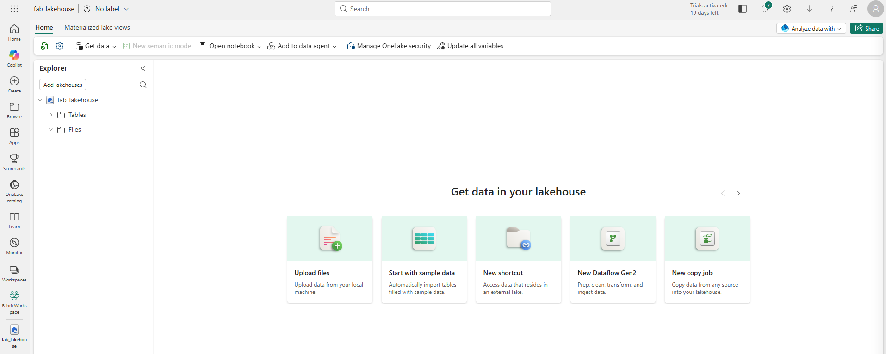
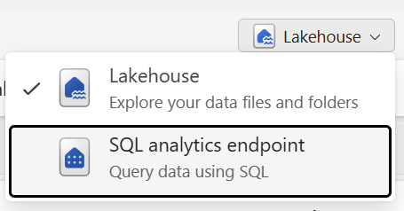

# Slides - Journee Microsoft Fabric DP-700

Ces slides sont une trame Markdown. Chaque separateur `---` peut devenir une slide.

---

## Microsoft Fabric en une phrase

Microsoft Fabric est une plateforme SaaS d'analytics end-to-end qui reunit ingestion, stockage, transformation, temps reel, data warehouse, modeles semantiques et Power BI autour de OneLake.

---

## Pourquoi Fabric interesse un data engineer

- Moins d'integration entre services separes.
- Un stockage logique commun : OneLake.
- Des moteurs adaptes : Spark, SQL, Power Query, KQL.
- Une exposition rapide : SQL endpoint, modele semantique, Power BI.
- Une gouvernance commune : workspace, permissions, lineage, Purview.

---

## Carte mentale Fabric

Le workspace est le conteneur operationnel : il regroupe lakehouses, notebooks, pipelines, warehouses, modeles semantiques et rapports.

---

## OneLake

OneLake est le lac logique du tenant Fabric.

- Une base commune pour les charges de travail Fabric.
- Donnees ouvertes : fichiers, Parquet, Delta Lake.
- Raccourcis pour referencer sans copier.
- Catalogue pour decouvrir, documenter et gouverner.

---

## Lakehouse

Un lakehouse Fabric combine :

- `Files` : fichiers bruts ou semi-structures.
- `Tables` : tables Delta interrogeables par Spark et SQL endpoint.
- Spark notebooks pour transformer.
- SQL analytics endpoint pour interroger en T-SQL.

---

## Warehouse vs Lakehouse

| Besoin | Lakehouse | Warehouse |
| --- | --- | --- |
| Fichiers bruts, JSON, Parquet | Tres adapte | Moins direct |
| Spark et data engineering code-first | Tres adapte | Non prioritaire |
| T-SQL complet avec DML | Limite via endpoint lecture seule | Tres adapte |
| Modelisation analytique SQL | Possible | Tres adapte |
| Architecture medaillon | Tres adapte | Utile surtout en gold |

---

## Ingestion et transformation

| Outil | Quand l'utiliser |
| --- | --- |
| Pipeline | Orchestrer, copier, parametrer, planifier |
| Dataflow Gen2 | Transformer en low-code avec Power Query |
| Notebook | PySpark, scraping, API, logique custom, Delta |
| T-SQL | Requetes analytiques, vues, logique warehouse |
| KQL | Flux et logs temps reel |

---

## SQL analytics endpoint

Chaque lakehouse provisionne automatiquement un SQL analytics endpoint.

- Requetes T-SQL sur tables Delta.
- Lecture seule pour modifier les donnees lakehouse.
- Vues, fonctions et securite SQL possibles.
- Point d'entree naturel pour BI et exploration.

---

## Architecture medaillon

L'architecture medaillon organise la qualite des donnees en trois couches.

- Bronze : donnees brutes, rejouables.
- Silver : donnees nettoyees, typees, dedupliquees.
- Gold : donnees metier, agregees ou modelisees pour analyse.

---

## Exemple de vrai pipeline

Pour Books to Scrape :

1. Scraper le catalogue et les pages detail.
2. Sauvegarder le HTML brut.
3. Extraire en JSONL.
4. Nettoyer et typer en Silver.
5. Construire Gold pour SQL/Power BI.
6. Orchestrer par pipeline.
7. Controler la qualite.

---

## Ce qu'on doit retenir pour DP-700

- Choisir le bon moteur selon le besoin.
- Concevoir les zones et les tables.
- Orchestrer et parametrer.
- Securiser et gouverner.
- Monitorer et optimiser.
- Produire une couche gold consommable.

---

## Question de cloture

Vous avez une source web fragile, une equipe BI pressee et un besoin de rejouer les donnees.

Quelle architecture proposez-vous dans Fabric, et pourquoi ?

