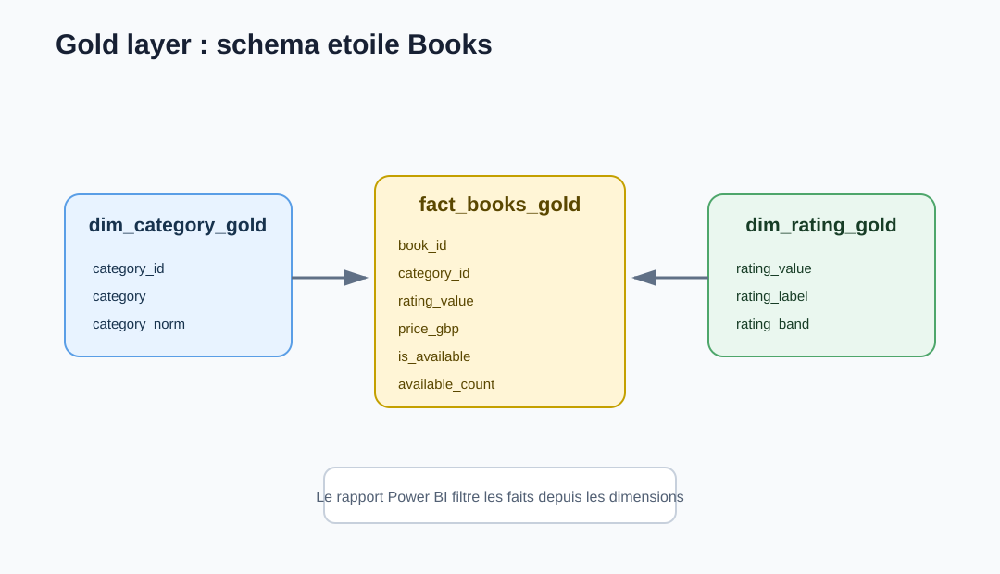

# 02 - Architecture cible

## Flux logique


## Bronze

Role : conserver les donnees au plus proche de la source.

Contenu :

- HTML brut des pages catalogue.
- HTML brut des pages detail.
- JSON Lines extrait depuis le HTML.
- Logs d'ingestion.

Pourquoi garder le HTML ?

- Le scraping est fragile.
- Le parseur peut etre corrige plus tard.
- On peut rejouer l'extraction sans refaire 1000 appels HTTP.

## Silver

Role : produire des donnees propres et exploitables.

Transformations :

- Nettoyage des titres.
- Extraction du prix en decimal.
- Conversion des notes textuelles en entier de 1 a 5.
- Normalisation des categories.
- Parsing de la disponibilite.
- Deduplication.
- Rejet des lignes invalides.

Tables :

- `silver_books`
- `silver_categories`
- `silver_books_rejected`

## Gold

Role : produire des donnees metier consommables.

Tables :

- `gold_book_catalog` : catalogue denormalise pour exploration rapide.
- `gold_category_stats` : agregats par categorie.
- `dim_category_gold`, `dim_rating_gold`, `fact_books_gold` : base de schema etoile.



## Orchestration

Pipeline cible :

```text
nb_01_ingest_books_bronze
  -> nb_02_transform_books_silver
  -> nb_03_build_books_gold
  -> nb_04_data_quality_checks
```

Lineage Fabric attendu pour la couche notebooks :


## Exposition

- SQL analytics endpoint pour exploration T-SQL.
- Modele semantique Power BI sur tables gold.
- Rapport Power BI avec categories, notes, prix et disponibilite.
