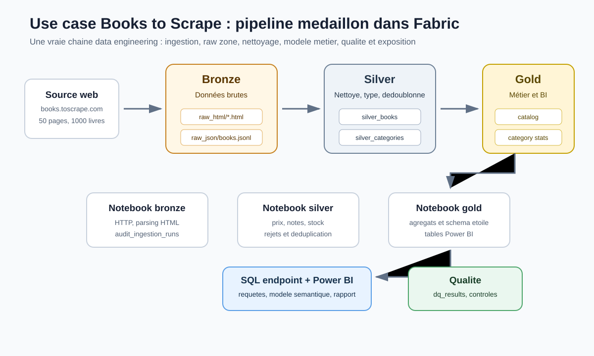
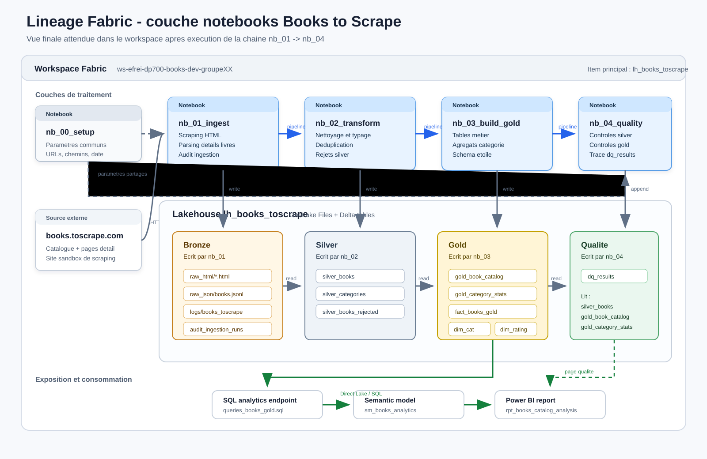

# Use case end-to-end - Books to Scrape

## Besoin metier

Une equipe produit veut comprendre la structure d'un catalogue de livres en ligne :

- Quelles categories contiennent le plus de livres ?
- Quels sont les prix moyens, minimum et maximum par categorie ?
- Quelle est la distribution des notes ?
- Quels livres sont disponibles ?
- Quelles categories combinent prix eleve et bonne note ?

Le dataset vient de [Books to Scrape](https://books.toscrape.com/), un site sandbox pour s'entrainer au web scraping. La page d'accueil indique 1000 resultats, 20 livres par page, et precise que les prix et notes sont fictifs.

## Architecture Fabric cible



Vue lineage Fabric de la couche notebooks :



Items Fabric :

| Item | Nom recommande | Role |
| --- | --- | --- |
| Workspace | `ws-efrei-dp700-books-dev-groupeXX` | Conteneur projet |
| Lakehouse | `lh_books_toscrape` | Stockage Files + Tables |
| Notebook | `nb_00_setup` | Parametres et conventions |
| Notebook | `nb_01_ingest_books_bronze` | Scraping, HTML brut, JSONL |
| Notebook | `nb_02_transform_books_silver` | Nettoyage, typage, deduplication |
| Notebook | `nb_03_build_books_gold` | Tables metier et modele etoile |
| Notebook | `nb_04_data_quality_checks` | Controle qualite et audit |
| Pipeline | `pl_books_toscrape_end_to_end` | Orchestration |
| Semantic model | `sm_books_analytics` | Couche Power BI |
| Report | `rpt_books_catalog_analysis` | Restitution |

## Organisation Lakehouse

```text
Files/
  bronze/books_toscrape/
    raw_html/ingestion_date=YYYY-MM-DD/
    raw_json/ingestion_date=YYYY-MM-DD/books.jsonl
  logs/books_toscrape/

Tables/
  audit_ingestion_runs
  silver_books
  silver_categories
  silver_books_rejected
  gold_book_catalog
  gold_category_stats
  dim_category_gold
  dim_rating_gold
  fact_books_gold
  dq_results
```

## Choix d'architecture

Pour un cours d'une journee, on implemente les trois couches dans un seul lakehouse. En production, vous pouvez separer bronze, silver et gold dans plusieurs lakehouses ou workspaces pour renforcer les frontieres d'acces et de gouvernance.

## Ordre de realisation

1. Lire `01-cadrage-metier.md`.
2. Lire `02-architecture-cible.md`.
3. Suivre `03-guide-fabric-pas-a-pas.md`.
4. Creer les notebooks a partir des scripts du dossier `notebooks/`.
5. Executer les notebooks dans l'ordre.
6. Creer le pipeline.
7. Executer les requetes SQL et preparer le modele Power BI.
