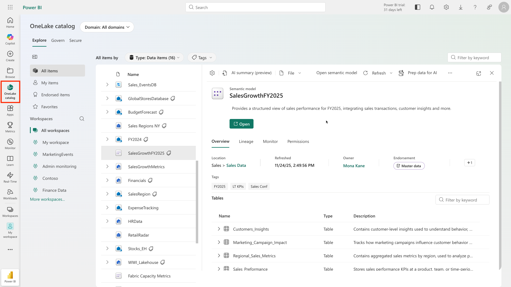

# Commencez avec les lakehouses dans Microsoft Fabric

| Propriété | Valeur |
|-----------|--------|
| **Durée** | 45 minutes (7 unités) |
| **Niveau** | Débutant |
| **Rôles** | Analyste de données · Ingénieur Data · Data Scientist |
| **Produit** | Microsoft Fabric |
| **Module MS Learn** | [get-started-lakehouses](https://learn.microsoft.com/fr-fr/training/modules/get-started-lakehouses/) |

---

## Objectifs d'apprentissage

Dans ce module, vous allez découvrir comment :

- Décrire les fonctionnalités de base et les capacités des lakehouses dans Microsoft Fabric
- Créer un lakehouse dans un espace de travail Fabric
- Ingérer et transformer des données dans un lakehouse
- Interroger et analyser des données lakehouse avec SQL et Apache Spark

## Prérequis

Avant de commencer ce module, vous devez :

- Comprendre les concepts fondamentaux du stockage des données et de l'analytique
- Avoir une connaissance de base des bases de données relationnelles et de SQL
- Être familiarisé avec l'interface Microsoft Fabric (espace de travail, items)

---

## 1. Introduction

*2 minutes*

Les solutions d'analytique de données à grande échelle ont traditionnellement été construites autour d'un **entrepôt de données** (*data warehouse*), dans lequel les données sont stockées dans des tables relationnelles et interrogées en SQL. Avec l'explosion du volume, de la variété et de la vélocité des données (les "3 V" du Big Data), associée aux technologies de stockage cloud à faible coût, une autre approche est apparue : le **lac de données** (*data lake*).

Dans un data lake, les données sont stockées sous forme de fichiers bruts sans schéma fixe imposé lors du stockage. Cela offre une flexibilité maximale, mais rend les requêtes analytiques plus complexes.

La **maison au bord du lac** (*lakehouse*) combine le meilleur des deux mondes :
- La **flexibilité** et l'**économie** du stockage en lac de données
- Les **capacités analytiques** et la **structure** des entrepôts de données

Microsoft Fabric implémente ce concept via un lakehouse basé sur **OneLake** et le format de table ouvert **Delta Lake**.

---

## 2. Décrire les caractéristiques et les capacités d'un Lakehouse

*5 minutes*

### Architecture d'un Lakehouse Fabric

Un lakehouse Microsoft Fabric est composé de trois éléments fondamentaux :

**OneLake** — Le stockage unifié
OneLake est le lac de données unique de Microsoft Fabric, construit sur Azure Data Lake Storage Gen2. Chaque workspace Fabric possède exactement un OneLake, partagé par tous les items (lakehouses, warehouses, datasets). Cette architecture élimine les silos de données.

**Delta Lake** — La couche transactionnelle
Les tables dans un lakehouse Fabric sont basées sur le format open source Delta Lake. Delta Lake ajoute une couche de gestion transactionnelle au-dessus du stockage de fichiers Parquet, apportant les propriétés ACID (Atomicité, Cohérence, Isolation, Durabilité) aux opérations sur les données.

**SQL Analytics Endpoint** — L'interface relationnelle
Chaque lakehouse expose automatiquement un endpoint SQL en lecture seule qui permet d'interroger les tables Delta Lake avec des requêtes SQL standard, sans code Spark.


### Structure d'un Lakehouse : Tables vs Fichiers

Lorsque vous ouvrez un lakehouse dans Fabric, l'explorateur affiche deux zones distinctes :

#### La zone Tables
- Contient les **tables Delta Lake gérées** (managed tables)
- Chaque table est stockée sous forme de fichiers Parquet avec un journal de transaction `_delta_log`
- Accessible via SQL, PySpark, et l'endpoint SQL analytics
- Schéma défini et imposé automatiquement

#### La zone Files
- Contient les **fichiers bruts** dans OneLake (CSV, JSON, Parquet, images, etc.)
- Accessible via les APIs de fichiers Fabric, Spark, ou les raccourcis
- Aucun schéma imposé : flexibilité maximale
- Idéal pour les données brutes en attente de transformation

**Analogie** : Imaginez votre lakehouse comme une cuisine professionnelle. La zone "Files" est comme le cellier (garde-manger) où les ingrédients bruts sont stockés en vrac. La zone "Tables" est comme les plans de travail organisés où tout est préparé, étiqueté, et prêt à être utilisé immédiatement.

### Les Raccourcis (Shortcuts)

Les raccourcis sont une fonctionnalité unique d'un lakehouse Fabric qui permet d'inclure des données stockées **à l'extérieur** du lakehouse sans les copier physiquement. Un raccourci apparaît comme un dossier ou une table dans l'explorateur, mais pointe vers :
- Un autre lakehouse dans le même workspace ou un workspace différent
- Azure Data Lake Storage Gen2
- Amazon S3
- Google Cloud Storage
- Dataverse

**Avantage clé** : Élimine la duplication des données tout en permettant l'analyse unifiée. Un raccourci vers ADLS permet de requêter les données ADLS directement depuis Fabric.

### Comparaison : Lakehouse vs Data Warehouse vs Data Lake

| Caractéristique | Data Lake | Data Warehouse | Lakehouse |
|----------------|-----------|----------------|-----------|
| Format de stockage | Fichiers (CSV, JSON, Parquet) | Tables relationnelles | Fichiers Delta Lake |
| Schéma | Schema-on-read | Schema-on-write | Schema-on-write (tables) + Schema-on-read (files) |
| Requêtes SQL | Limité | Oui, complet | Oui, via endpoint SQL |
| Requêtes Spark | Oui | Non natif | Oui, natif |
| Coût stockage | Faible | Élevé | Faible |
| Transactions ACID | Non | Oui | Oui (Delta Lake) |
| Données non structurées | Oui | Non | Oui (zone Files) |
| Cas d'usage | Stockage brut, ML | Reporting, BI | Tout (ETL, BI, ML, streaming) |

---

## 3. Ingérer et transformer des données dans un lakehouse

*7 minutes*

### Méthodes d'ingestion disponibles

Microsoft Fabric offre plusieurs approches pour charger des données dans un lakehouse :

#### 1. Upload direct (fichiers locaux)
La méthode la plus simple pour les petits volumes ou les tests. Utilisez l'explorateur du lakehouse pour uploader des fichiers CSV, Parquet, JSON, etc. directement depuis votre ordinateur.

```
Lakehouse Explorer → Files → ... → Upload → Upload files/folder
```

#### 2. Raccourcis (Shortcuts)
Pour référencer des données existantes sans les copier. Créez un raccourci vers ADLS Gen2, S3, ou un autre lakehouse.

#### 3. Dataflows Gen2 (Power Query Online)
Interface visuelle no-code/low-code pour connecter des sources, transformer les données avec Power Query, et charger dans le lakehouse. Idéal pour les transformations de niveau analytique sans code.

#### 4. Pipelines Data Factory
Orchestration d'activités ETL complexes : Copy Activity, Notebook Activity, Stored Procedure Activity. Adapté aux workflows automatisés et planifiés.

#### 5. Notebooks Apache Spark
Code PySpark ou Scala pour des transformations complexes, du ML, ou du traitement en streaming.

#### 6. COPY INTO (SQL)
Commande SQL pour ingérer des fichiers depuis OneLake ou ADLS directement dans une table Delta.

### Charger un fichier CSV vers une table Delta

La manière la plus rapide de créer une table depuis un fichier existant est d'utiliser l'option "Load to Table" dans l'explorateur :

1. Uploadez un fichier CSV dans la zone `Files`
2. Clic droit sur le fichier → **Load to Tables** → **New table**
3. Fabric crée automatiquement une table Delta avec le schéma inféré depuis le CSV

**Ce que Fabric fait en coulisse :**
- Infère le schéma du CSV
- Convertit les données en format Parquet
- Crée le journal de transaction `_delta_log`
- Enregistre la table dans le metastore

### Exemple : Créer et charger une table avec PySpark

```python
# Lire un fichier CSV depuis la zone Files
df = spark.read.format("csv") \
    .option("header", "true") \
    .option("inferSchema", "true") \
    .load("Files/data/sales.csv")

# Afficher un aperçu des données
display(df.limit(10))

# Sauvegarder comme table Delta dans la zone Tables
df.write \
    .format("delta") \
    .mode("overwrite") \
    .saveAsTable("sales")

print("Table 'sales' créée avec succès !")
```

### Vérifier la structure des fichiers Delta

```python
# Voir les fichiers sous-jacents d'une table Delta
# Les tables Delta sont stockées en Parquet + _delta_log
# Files/tables/sales/
#   ├── part-00000-xxxx.snappy.parquet
#   ├── part-00001-xxxx.snappy.parquet
#   └── _delta_log/
#         ├── 00000000000000000000.json
#         └── 00000000000000000001.json
```

---

## 4. Interroger et analyser des données lakehouse

*7 minutes*

### L'endpoint SQL Analytics

Chaque lakehouse Fabric expose automatiquement un **SQL Analytics Endpoint** — un point d'accès SQL en lecture seule basé sur le moteur serverless de Microsoft. Ce endpoint permet à tout utilisateur familier avec SQL de requêter les données du lakehouse sans avoir besoin de connaître Spark ou Python.

**Basculer vers le SQL endpoint :**
Dans l'interface du lakehouse, en haut à droite, basculez entre **Lakehouse** et **SQL analytics endpoint**.

**Caractéristiques du SQL endpoint :**
- Supporte T-SQL (SELECT, JOIN, GROUP BY, HAVING, etc.)
- Permet de créer des vues, fonctions, et procédures stockées (en lecture)
- Compatible avec Power BI (connection DirectLake ou Import)
- Pas d'opérations DML (INSERT, UPDATE, DELETE) — les modifications passent par Spark ou les outils Fabric

### Requête SQL de base

```sql
-- Calculer le chiffre d'affaires par produit
SELECT 
    Item,
    SUM(Quantity * UnitPrice) AS Revenue,
    COUNT(*) AS NumberOfOrders
FROM sales
GROUP BY Item
ORDER BY Revenue DESC;
```

### Requête visuelle avec Power Query

Pour les utilisateurs non-SQL, le SQL endpoint propose un éditeur de requêtes visuelles basé sur Power Query :

1. Dans le SQL endpoint, sélectionnez **New visual query**
2. Glissez-déposez la table `sales` dans l'éditeur
3. Utilisez les menus visuels pour filtrer, regrouper, joindre

**Exemple de requête visuelle :**
- Sélectionner les colonnes `SalesOrderNumber` et `SalesOrderLineNumber`
- Regrouper par `SalesOrderNumber` → Count distinct de `SalesOrderLineNumber`
- Résultat : nombre de lignes par commande

### Interroger avec PySpark dans un Notebook

```python
# Option 1 : Spark SQL (syntaxe SQL dans un notebook)
df_revenue = spark.sql("""
    SELECT 
        Item,
        SUM(Quantity * UnitPrice) AS Revenue,
        AVG(UnitPrice) AS AvgUnitPrice
    FROM sales
    GROUP BY Item
    ORDER BY Revenue DESC
""")
display(df_revenue)

# Option 2 : API DataFrame PySpark
from pyspark.sql.functions import col, sum as spark_sum, avg

df_revenue = spark.table("sales") \
    .groupBy("Item") \
    .agg(
        spark_sum(col("Quantity") * col("UnitPrice")).alias("Revenue"),
        avg("UnitPrice").alias("AvgUnitPrice")
    ) \
    .orderBy(col("Revenue").desc())

display(df_revenue)
```

### Vue d'ensemble du Lakehouse Catalog

Le OneLake Catalog (accessible depuis le menu gauche de Fabric) donne une vue d'ensemble de tous les lakehouses, tables, et fichiers dans votre workspace. C'est le point de départ pour la gouvernance et la découverte des données.



---

## 5. Exercice — Créer un Microsoft Fabric Lakehouse

*30 minutes*

> **Prérequis** : Accès à une capacité Fabric (Trial, Premium, ou Fabric F2+)

### Étapes de l'exercice

**Étape 1 — Créer un espace de travail**
1. Naviguer vers [app.fabric.microsoft.com](https://app.fabric.microsoft.com/home?experience=fabric)
2. Dans le menu gauche, sélectionner **Workspaces** → **+ New workspace**
3. Donner un nom unique et sélectionner une capacité Fabric dans la section Advanced
4. Attendre que le workspace vide apparaisse

**Étape 2 — Créer un Lakehouse**
1. Dans le workspace, sélectionner **Create** → **Lakehouse** (section Data Engineering)
2. Nommer le lakehouse (ex: `MonLakehouse`)
3. Observer l'explorateur avec les dossiers Tables (vide) et Files (vide)

**Étape 3 — Uploader un fichier**
1. Télécharger [sales.csv](https://raw.githubusercontent.com/MicrosoftLearning/dp-data/main/sales.csv)
2. Dans l'explorateur, `Files` → `...` → **New subfolder** → nommer `data`
3. Sur le dossier `data` → `...` → **Upload** → **Upload files** → sélectionner `sales.csv`
4. Cliquer sur le fichier pour voir l'aperçu des données

**Étape 4 — Explorer les raccourcis**
1. `Files` → `...` → **New shortcut**
2. Observer les types de sources disponibles (ADLS, S3, autre Lakehouse, etc.)
3. Fermer sans créer de raccourci

**Étape 5 — Charger le fichier dans une table**
1. Sélectionner le dossier `Files/data`
2. Sur `sales.csv` → `...` → **Load to Tables** → **New table**
3. Garder le nom `sales`, confirmer
4. Attendre la création de la table
5. Dans l'explorateur, sélectionner la table `sales` pour voir les données

**Étape 6 — Interroger avec SQL**
1. Basculer vers **SQL analytics endpoint** (bouton en haut à droite)
2. Sélectionner **New SQL query**
3. Exécuter :
```sql
SELECT Item, SUM(Quantity * UnitPrice) AS Revenue
FROM sales
GROUP BY Item
ORDER BY Revenue DESC;
```
4. Observer les résultats du chiffre d'affaires par produit

**Étape 7 — Créer une requête visuelle**
1. **New SQL query** → **New visual query**
2. Glisser la table `sales` dans l'éditeur
3. Dans **Manage columns** → **Choose columns** : sélectionner `SalesOrderNumber` et `SalesOrderLineNumber`
4. Dans **Transform** → **Group by** : grouper par `SalesOrderNumber`, nouveau nom `LineItems`, opération `Count distinct values` sur `SalesOrderLineNumber`
5. Observer le nombre de lignes par commande

---

## 6. Évaluation des connaissances

*5 minutes*

**Question 1** : Quelle est la principale différence entre la zone "Tables" et la zone "Files" d'un lakehouse Fabric ?

- A) La zone Tables stocke uniquement des fichiers CSV, la zone Files stocke tous les formats
- B) La zone Tables contient des tables Delta Lake avec schéma imposé, la zone Files contient des fichiers bruts sans schéma géré
- C) La zone Files est en lecture seule, la zone Tables est en lecture-écriture
- D) Il n'y a pas de différence, les deux zones accèdent aux mêmes données

> **Réponse : B** — La zone Tables gère des tables Delta Lake avec transactions ACID et schéma. La zone Files héberge des fichiers bruts de tout format sans gestion de schéma automatique.

---

**Question 2** : Qu'est-ce qu'un "shortcut" (raccourci) dans Microsoft Fabric ?

- A) Un lien hypertexte vers un rapport Power BI
- B) Un alias pour une requête SQL souvent utilisée
- C) Un pointeur vers des données stockées dans un autre emplacement, sans copie physique
- D) Un snapshot rapide d'une table pour les sauvegardes

> **Réponse : C** — Les raccourcis permettent d'inclure des données externes (ADLS, S3, autre lakehouse) dans le lakehouse sans dupliquer le stockage.

---

**Question 3** : Le SQL Analytics Endpoint d'un lakehouse Fabric permet de :

- A) Écrire des données via INSERT, UPDATE et DELETE
- B) Interroger les tables Delta Lake uniquement en lecture avec T-SQL
- C) Exécuter des notebooks PySpark directement
- D) Créer de nouvelles tables Delta Lake depuis SQL

> **Réponse : B** — Le SQL endpoint est en lecture seule. Il supporte SELECT, vues, et fonctions, mais pas les modifications DML. Les écritures se font via Spark, Dataflows ou Pipelines.

---

**Question 4** : Quel format de fichier est utilisé pour stocker les données des tables dans un lakehouse Fabric ?

- A) CSV compressé (gzip)
- B) ORC (Optimized Row Columnar)
- C) Parquet avec journal de transactions Delta Lake (`_delta_log`)
- D) Avro

> **Réponse : C** — Les tables Fabric utilisent le format Delta Lake, qui stocke les données en Parquet et maintient un journal `_delta_log` pour les transactions ACID.

---

**Question 5** : Dans quel scénario est-il préférable d'utiliser un raccourci plutôt que de copier les données dans le lakehouse ?

- A) Quand les données changent fréquemment et doivent être à jour en temps réel sans duplication
- B) Quand les données doivent être transformées avant d'être analysées
- C) Quand les performances des requêtes sont critiques et que la latence réseau est inacceptable
- D) Quand les données sont des fichiers locaux sur un PC

> **Réponse : A** — Les raccourcis sont idéaux quand les données source changent fréquemment et quand on veut éviter la copie et la synchronisation. Les données restent dans leur emplacement d'origine.

---

## 7. Résumé

*2 minutes*

Dans ce module, vous avez découvert les lakehouses Microsoft Fabric :

- Un **lakehouse** combine la flexibilité d'un data lake avec les capacités analytiques d'un data warehouse
- **OneLake** est le stockage unifié de Microsoft Fabric, basé sur ADLS Gen2
- Les **tables Delta Lake** offrent des transactions ACID, un schéma imposé, et des performances optimisées
- La zone **Files** permet de stocker des données brutes de tout format
- Les **raccourcis** permettent de référencer des données externes sans copie
- Le **SQL Analytics Endpoint** permet d'interroger les tables en T-SQL standard
- Plusieurs méthodes d'ingestion : upload direct, Dataflows Gen2, Pipelines, Notebooks Spark

### Points clés à retenir pour l'examen DP-700

1. Les tables d'un lakehouse Fabric sont **toujours** au format Delta Lake
2. Le SQL endpoint est **en lecture seule** — pas de DML direct
3. OneLake est **unique par workspace** — tous les items partagent le même stockage
4. Les raccourcis n'**impliquent pas de copie** des données
5. Spark et SQL sont **deux interfaces** vers les mêmes données Delta Lake

---

## Liens utiles

- [Module Microsoft Learn](https://learn.microsoft.com/fr-fr/training/modules/get-started-lakehouses/)
- [Documentation : Lakehouses dans Microsoft Fabric](https://learn.microsoft.com/fr-fr/fabric/data-engineering/lakehouse-overview)
- [Documentation : OneLake](https://learn.microsoft.com/fr-fr/fabric/onelake/onelake-overview)
- [Documentation : Delta Lake dans Fabric](https://learn.microsoft.com/fr-fr/fabric/data-engineering/lakehouse-and-delta-tables)
- [Lab GitHub](https://microsoftlearning.github.io/mslearn-fabric/Instructions/Labs/01-lakehouse.html)
